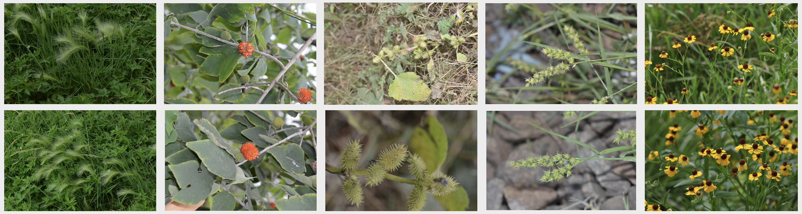
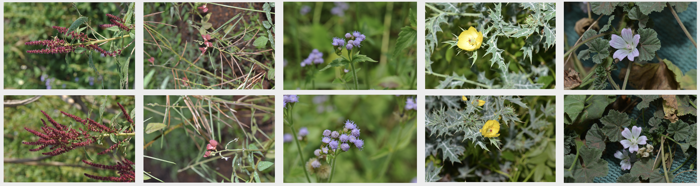
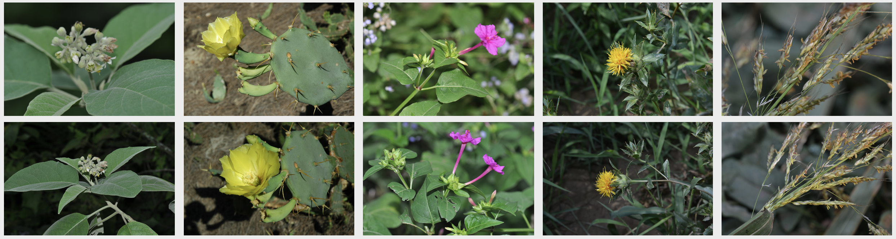
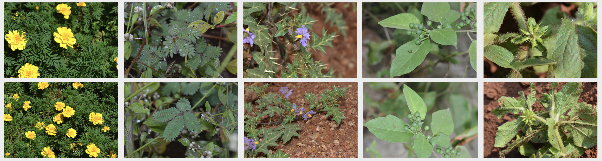
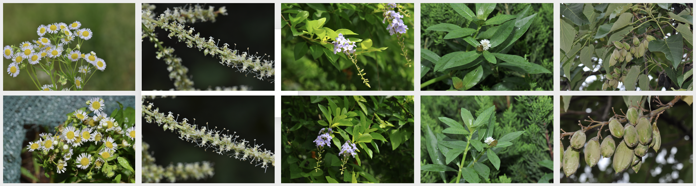

# PlantRSR

This repository contains the implementation of the following paper:
PlantRSR: A New Plant Dataset and Method for Reference-based Super-Resolution

## Overview


## Dependencies and Installation

- Python >= 3.8
- CUDA 12.1
- PyTorch >= 2.2.1
- mamba-ssm >= 2.1.0
- MinkowskiEngine >= 0.5.4

## Dataset Preparation

- Train Set: [Our PlantRSR Dataset](https://www.kaggle.com/datasets/a6fef9d2a40fce2c839e4160970d555fe08b7a8c1a7454a77d71b6f9108ee928), [CUFED Dataset](https://drive.google.com/drive/folders/1hGHy36XcmSZ1LtARWmGL5OK1IUdWJi3I)
- Test Set: [Our PlantRSR Dataset](https://www.kaggle.com/datasets/a6fef9d2a40fce2c839e4160970d555fe08b7a8c1a7454a77d71b6f9108ee928), [WR-SR Dataset](https://drive.google.com/drive/folders/16UKRu-7jgCYcndOlGYBmo5Pp0_Mq71hP?usp=sharing), [CUFED5 Dataset](https://drive.google.com/file/d/1Fa1mopExA9YGG1RxrCZZn7QFTYXLx6ph/view)

Please refer to [Datasets.md](datasets/DATASETS.md) for pre-processing and more details.

## Get Started

### PlantRSR Dataset
Downloading the training dataset from this [link](https://www.kaggle.com/datasets/a6fef9d2a40fce2c839e4160970d555fe08b7a8c1a7454a77d71b6f9108ee928) 

Downloading the testing dataset from this [link](https://www.kaggle.com/datasets/a6fef9d2a40fce2c839e4160970d555fe08b7a8c1a7454a77d71b6f9108ee928) 

<div align=center>

    
    
    
    
</div>

### Pretrained Models and results
The pretrained models from this [link](https://huggingface.co/youling2/PlantRSR/tree/main/trained_models) and the results from this [link](https://huggingface.co/youling2/PlantRSR/tree/main/results).

### Test

We provide quick test code with the pretrained model.

1. Modify the paths to dataset and pretrained model in the following yaml files for configuration.

    ```bash
    ./options/test/test_PlantRSR_gan.yml
    ./options/test/test_PlantRSR_mse.yml
    ```

1. Run test code for models trained using **GAN loss**.

    ```bash
    python mmsr/test.py -opt "options/test/test_PlantRSR_gan.yml"
    ```

   Check out the results in `./results`.

1. Run test code for models trained using only **reconstruction loss**.

    ```bash
    python mmsr/test.py -opt "options/test/test_PlantRSR_mse.yml"
    ```

   Check out the results in in `./results`


### Train

All logging files in the training process, *e.g.*, log message, checkpoints, and snapshots, will be saved to `./experiments` and `./tb_logger` directory.

1. Modify the paths to dataset in the following yaml files for configuration.
   ```bash
   ./options/train/stage1_teacher_contras_network.yml
   ./options/train/stage2_student_contras_network.yml
   ./options/train/stage3_restoration_gan.yml
   ```

1. Stage 1: Train teacher contrastive network.
   ```bash
   python mmsr/train.py -opt "options/train/stage1_teacher_contras_network.yml"
   ```

1. Stage 2: Train student contrastive network.
   ```bash
   # add the path to *pretrain_model_teacher* in the following yaml
   # the path to *pretrain_model_teacher* is the model obtained in stage1
   ./options/train/stage2_student_contras_network.yml
   python mmsr/train.py -opt "options/train/stage2_student_contras_network.yml"
   ```

1. Stage 3: Train restoration network.
   ```bash
   # add the path to *pretrain_model_feature_extractor* in the following yaml
   # the path to *pretrain_model_feature_extractor* is the model obtained in stage2
   ./options/train/stage3_restoration_gan.yml
   python mmsr/train.py -opt "options/train/stage3_restoration_gan.yml"

   # if you wish to train the restoration network with only mse loss
   # prepare the dataset path and pretrained model path in the following yaml
   ./options/train/stage3_restoration_mse.yml
   python mmsr/train.py -opt "options/train/stage3_restoration_mse.yml"
   ```
